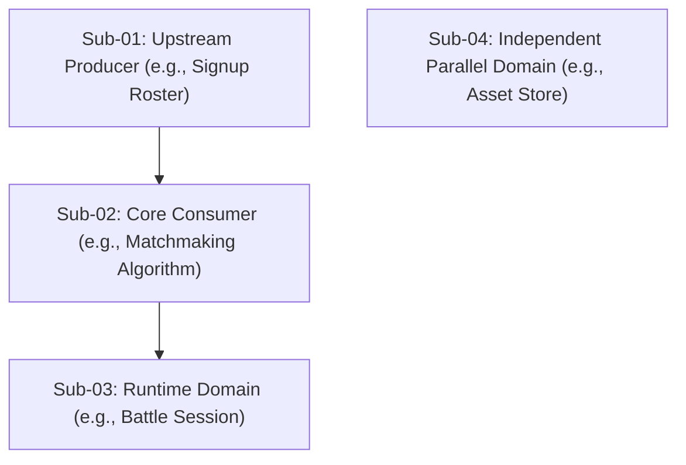

Compile the confirmed consensus from the conversation, structured alignment artifacts, or completed planning maps into a cohesive, high-density, authoritative **Specification Blueprint**.

A specification defines the **complete, invariant truth of the destination** (what the finished system/artifact looks like, its change boundaries, contracts, and what must NOT break). It is NOT an interview questionnaire, NOT a lossy narrative summary, and NOT a premature execution schedule.

## Maintenance

When reviewing, modifying, or redesigning this skill, read [`MAINTENANCE.md`](MAINTENANCE.md) first. It records design rationale, community issue lineage, real-world topology validation, and anti-drift rules; it is not needed for ordinary runtime execution.

## 1. Core Principles & Philosophy

- **High-Cohesion Blueprint (No Premature Slicing)**:
  Describe the complete system, its holistic entities, and its unified state machine as an indivisible whole. **Do NOT prematurely slice the Spec into vertical execution schedules or task tickets inside the document.** Slicing is the exclusive responsibility of downstream planning or ticketing workflows.
- **Upstream & Downstream Decoupling**:
  Never assume or mandate specific preceding workflows (e.g. particular interview tools) or specific downstream execution tools (e.g. particular testing or review commands). Produce a standalone, self-contained specification that any human engineer, QA team, contractor, or automated agent can directly consume.
- **Brownfield Safety & Surgical Scope**:
  In existing codebases or environments, explicitly declare **Touched Areas** (physical whitelist of files/schemas/packages allowed to change) and define **System Invariants** (inviolable contracts of untouched surrounding systems). For greenfield projects, naturally adapt to structural component definitions.
- **Epistemological Separation**:
  Strictly separate **Human Confirmed Choices (P0 Locked / Solid Lines)** from **AI Inferred Open Parameters (P1 Range Limits / Dashed Slots)**. Surface these via a top-level **Readiness Radar**. If all parameters are settled or no open variables exist, P1 is naturally empty without forced padding.
- **Decisions & Discarded Alternatives (ADR-Lite)**:
  Every major architectural or structural decision must record its **Rationale** and **Discarded Alternatives & Reasons** to prevent downstream implementers from re-proposing rejected approaches.
- **Contract vs. Implementation Separation**:
  Mandate exact public data structures (Struct, Interface, Proto, SQL DDL diff, state transition tables, or BOMs). **Strictly forbid private helper logic, internal glue code, or hidden scripts** inside the Spec.
- **Verifiable Acceptance (High-Signal Criteria)**:
  Focus acceptance criteria on essential behaviors, high-impact failure modes, and system invariant verifications, rather than enumerating trivial or repetitive checks. Choose whichever presentation makes verification clearest: narrative scenarios for critical flows, or a compact table when handling multiple parameter combinations.
- **Domain-Adaptive Native Projection**:
  Reason internally using the universal meta-skeleton, but **render the final document 100% in the native terminology, schemas, and concrete artifacts of the target domain**. Never output abstract meta-jargon.
- **Zero-Modal Friction**:
  Synthesize the Spec in a single turn without interrupting popups. Surface open uncertainties as explicit parameter range limits in Section 4.

## 2. Upstream Context Ingestion

Autonomously ingest the upstream context without imposing rigid workflow assumptions:
1. Extract confirmed user intent, verified facts, and architectural choices from the conversation, uploaded notes, meeting memos, or previous artifacts (e.g., from `/yjx-grill`).
2. Independently explore the existing environment (codebase, schemas, or project docs) to ground the design and identify brownfield safety boundaries.
3. Automatically derive safe boundary range limits for unaddressed micro-parameters without inventing concrete unvetted numbers.

## 3. Domain-Adaptive Native Projection & Localization

Identify the domain archetype and project the sections into concrete, hard-edged domain representations:

- **Software & Systems Engineering**:
  - Output exact Protobuf definitions, SQL DDL diffs, typed domain structs, and error code tables with complete field comments.
  - Render concrete API/RPC signatures, idempotency keys, and transaction boundary notes.
  - Detail exact invariant equations (e.g., balance conservation) and concrete automated test assertions.
- **Physical & Space Design (e.g., Interior Decoration)**:
  - Output Bill of Materials (BOM) with mm dimensions, Pantone color codes, material grades, and tolerances.
  - Render spatial clearance rules ($\ge 800\text{mm}$), MEP (mechanical, electrical, plumbing) coordinate specs, and environmental standards.
  - Detail physical inspection checklists and load-bearing constraints.
- **Processes, Operations & Business**:
  - Output RACI role responsibility matrices, phase gate transition tables, and escalation paths.
  - Detail SLA timeout parameters, audit logging invariants, and rehearsal checklists.

**Localization**: Keep this skill file in English. At runtime, render all user-facing Spec headings, labels, table headers, and explanatory prose into the user's conversational language.

## 4. Disambiguated Specification Template

Render the Specification using the disambiguated standard template below:

```markdown
# [<System / Feature / Target Name>] Specification

> **Metadata**:
> - **Origin**: <Link to upstream notes, session context, or initiative map>
> - **Domain**: <Software / Physical Design / Operations / etc.>
> - **Modality**: <Brownfield (Existing System Enhancement) | Greenfield (New System)>
> - **Readiness Radar**: 
>   - [x] P0 Locked Decisions (Human Confirmed): 100%
>   - [x] P1 Open Parameters Converged: 100% (Total: N items, all bounded within safety limits)
>   - [x] Safety Boundaries Verified
>   - [ ] Status: [ READY FOR IMPLEMENTATION & VERIFICATION ]

---

## 1. Scope & Surgical Boundary (目标、范围与手术边界)

### 1.1 Scope Boundaries
- **Core Goal**: The fundamental problem to solve and the promised outcome.
- **In-Scope**: Explicit capabilities, components, and boundaries delivered in this iteration.
- **Out-of-Scope**: Explicitly excluded items, future phases, or external system boundaries.

### 1.2 Surgical Scope (Touched Areas)
- **Touched Areas (Allowed Modifications)**:
  - Explicit list of packages, modules, database tables, schemas, drawings, or files permitted to change.
  - *(For Greenfield projects, list primary new packages and modules to be established)*.

---

## 2. Core Entities & Schemas (核心数据与实体契约)
<!-- Define public data contracts, schemas, DDLs, types, or BOMs. Strictly forbid private implementation logic. -->

---

## 3. Flows & State Model (业务流转与状态模型)
<!-- Global state machine transition table or lifecycle sequence matrix -->
| Current State (From) | Trigger / Action | Guard Condition | Next State (To) | Side Effects & Persistence |
| :--- | :--- | :--- | :--- | :--- |
| ... | ... | ... | ... | ... |

- **Failure, Timeout & Rollback Strategies**: Compensation mechanisms and terminal consistency guarantees during outages.

---

## 4. Decisions & Open Parameters (核心选型与待定参数)

### 4.1 P0 Locked Choices (Confirmed Decisions)
- **[Choice-01] <Decision Title>**:
  - **Rationale**: Why this option was chosen based on trade-offs.
  - **Discarded Alternatives & Reasons**: Why alternative options were rejected (prevents downstream regressions).

### 4.2 P1 Open Parameters (Inferred Safety Bounds)
<!-- If all parameters are locked upstream, this section can be marked 'None (All Locked)'. -->
- **[Param-01] <Parameter Title>**:
  - **Derivation Basis**: Why this parameter is needed.
  - **Range Limits**: Safe bounds for adjustment (e.g. `Timeout ∈ [3s, 5s] with exponential backoff`).
  - **Degree of Freedom**: Where and when this parameter should be finalized (e.g., config table or execution phase).

---

## 5. Interfaces & Protocols (接口与交互契约)
<!-- Public API/RPC signatures, network protocols, event definitions, or spatial assembly clearance tolerances -->

---

## 6. System Invariants & Forbidden Paths (全局不变量与行为禁令)

### 6.1 System Invariants (Inviolable Laws)
1. **[INV-01] <Invariant Name>**: Positive conservation laws, backward compatibility rules, and integrity constraints that must hold under all conditions.

### 6.2 Forbidden Paths (Anti-Patterns & Prohibitions)
1. **[FORBIDDEN-01] <Prohibition Name>**: Explicitly disallowed implementation shortcuts, silent error swallowing, or architectural violations.

---

## 7. Acceptance Criteria & Verifications (验收标准与验证断言)
<!-- Focus on essential behaviors and critical failure modes; use scenarios or a compact matrix based on clarity. -->

### 7.1 Core Scenarios
- **[Scene-01] <Critical Path / High-Risk Failure>**:
  - **Given** <Preconditions & Input State>
  - **When** <Triggering Action>
  - **Then** <Observable State Changes, Assertions & Persistence>

### 7.2 Scenario Assertion Matrix
| Case ID | Given (Preconditions) | When (Trigger) | Then (Verifiable Assertions) |
| :--- | :--- | :--- | :--- |
| ... | ... | ... | ... |

---

## 8. Implementation & Delivery Notes (实施与交付指引)
- Implementation prerequisites, key verification focus, and cross-team delivery notes.
```

## 5. Scale-Adaptive Topology & Contract References (For Mega-Initiatives)

When handling massive requirements spanning multiple orthogonal domains, heterogeneous lifecycles (e.g., daily store vs. weekly battle vs. multi-week season), or loosely coupled subsystems:

### 1. Topology Triggering Criteria
Trigger multi-spec decomposition ONLY when the initiative involves:
- Physically isolated deployment units (e.g., distinct microservices or client/server boundaries), OR
- Decoupled, orthogonal lifecycles and independent state machines that can be developed and verified in parallel.
*Never mechanically split a single cohesive, tightly coupled state machine into multiple sub-specs merely to reduce file length.*

### 2. Master Topology Spec (`MASTER_TOPOLOGY_SPEC.md` or `spec.md`)
The Master Spec serves as the **global constitutional blueprint and assembly map**. It contains:
- **Global Lifecycle Timeline**: End-to-end stage flow and cross-system clock orchestration.
- **Key Arbitration Points**: Explicit declaration of which subsystem authoritatively determines shared state variables (e.g., Mode resolution) and at what exact lifecycle milestone.
- **Global Shared Dictionary**: Cross-subsystem shared enums, base error codes, or common protobuf/DTO definitions.
- **Static DAG Dependency Matrix**: Visualized via Mermaid DAG and a Markdown matrix declaring prerequisite input/output data contracts (`Sub-Spec B consumes immutable output from Sub-Spec A`). **Strictly forbid embedding dynamic project management status (e.g., In-Progress / Done checkboxes) into the static Spec.**



### 3. Cluster / Island Sub-Specs (`specs/<unit-slug>.md`)
- Dedicated sub-specifications adhering to the 7-part template for each cohesive cluster or independent island.
- **Contract Cross-Reference Protocol**:
  - **Local Markdown Tracker (`.scratch/` or `specs/`)**: Use standard Markdown relative links with section anchors to preserve Single Source of Truth (SSOT), e.g., `[BattleMember Entity](01-signup-prepare.md#2-core-entities--schemas)`. Do NOT copy-paste redundant copies of data models.
  - **Remote Issue Tracker (GitHub / GitLab / Jira)**: Use native issue reference links (e.g., `Blocked by #101`, `See schema in #102`).

## 6. Issue Tracker & Storage Protocol

Consult repo conventions (or `docs/agents/issue-tracker.md`) to determine the storage target:
1. **Local Markdown Tracker (`.scratch/` ecosystem)**:
   - Write to `.scratch/<feature-slug>/spec.md` (or `MASTER_TOPOLOGY_SPEC.md` and `specs/<unit>.md` for multi-unit initiatives).
   - As a contract specification, do NOT assign `Status:` fields that pollute the execution kanban graph.
2. **Remote Issue Tracker (GitHub / GitLab / etc.)**:
   - If local docs are maintained, commit the markdown spec and open/update the Spec Issue via CLI.
   - Strictly adhere to the repo's canonical triage labels (e.g. apply `ready-for-agent` for completed specs). **Never invent custom labels** on remote trackers.
   - Express multi-unit hierarchy using issue titles (e.g., `[Spec] <Feature>: Master Architecture`) and native body links (`Parent: #...`, `Blocked by: #...`).

## 7. Forbidden Execution Paths

- **NEVER** use Agile User Stories (`As a... I want...`) as the primary specification vehicle.
- **NEVER** write private helper implementation logic or internal glue code inside the Spec (only public schemas/interfaces are allowed).
- **NEVER** invent unconfirmed micro-values without safety range limits. Always wrap unconfirmed items as explicit `[Param-XX]` entries in Section 4.2.
- **NEVER** mechanically generate dozens of trivial, repetitive scenario descriptions that pad document length without adding verifiable value.
- **NEVER** omit Touched Areas and System Invariants when operating in an existing codebase.
- **NEVER** prematurely slice the specification into vertical execution schedules or task tickets inside the document.
- **NEVER** embed dynamic project management status (e.g., progress checkboxes) into the static Master Topology Spec.
- **NEVER** copy-paste duplicate schemas across Sub-Specs. Always use native relative Markdown links or tracker references.
- **NEVER** modify production application source code or execute implementation commands within this skill.
